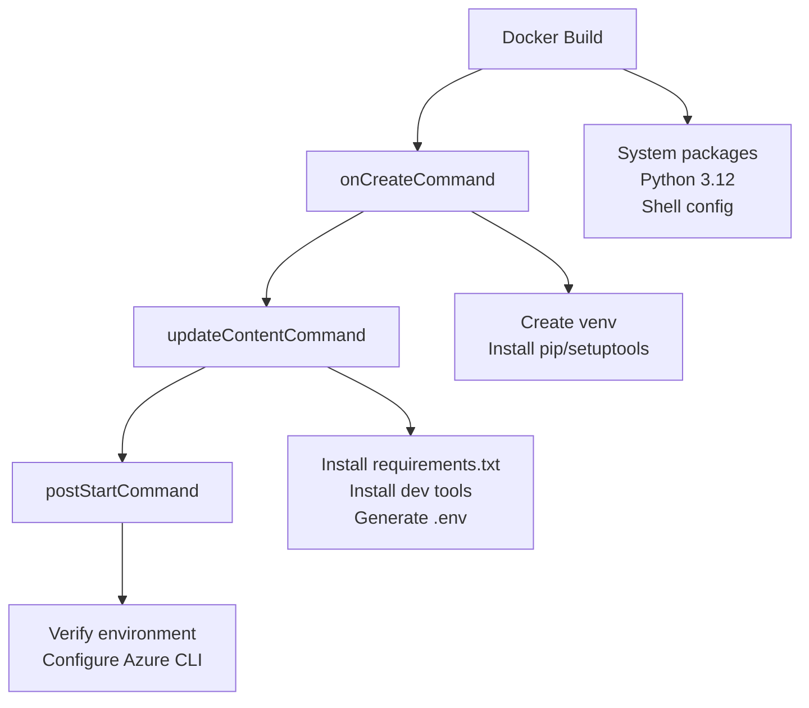

# Dev Container Configuration Summary

## ✅ Implementation Complete

This document summarizes the dev container configuration for the Azure API Management samples repository, now optimized for GitHub Codespaces prebuilds using best practices.

## 🎯 Objectives Achieved

### ✅ Single Python Environment
- **Location**: `/workspaces/Apim-Samples/.venv`
- **Version**: Python 3.12
- **Visibility**: Automatically visible and selected in VS Code
- **No Manual Selection**: VS Code automatically detects and uses this environment

### ✅ Robust Package Management
- **Requirements**: Installed from `requirements.txt`
- **Development Tools**: pytest, pytest-cov, coverage, ipykernel automatically included
- **Fresh Dependencies**: `updateContentCommand` ensures packages are current when repo content changes
- **Prebuild Optimized**: Package installation happens during prebuild for fast startup

### ✅ Codespaces & Prebuild Compatibility
- **Prebuild Support**: Environment creation during prebuild phase
- **Content Freshness**: `updateContentCommand` updates packages when requirements.txt changes
- **Fast Startup**: Only verification and configuration on each startup
- **Best Practices**: Follows GitHub Codespaces documentation recommendations

### ✅ Automatic Environment Configuration
- **`.env` File**: Always generated with correct PYTHONPATH
- **VS Code Integration**: Python interpreter auto-configured
- **Shell Integration**: Virtual environment auto-activated in bash/zsh
- **Azure CLI**: Extensions (containerapp, front-door) pre-installed

## 🏗️ Architecture

### Container Lifecycle (Optimized for Prebuilds)



### File Structure
```
/workspaces/Apim-Samples/
├── .venv/                          ← Single Python virtual environment
│   ├── bin/python                  ← Python 3.12 executable  
│   ├── lib/python3.12/site-packages/ ← All packages
│   └── ...
├── .env                            ← Auto-generated environment variables
├── requirements.txt                ← Package dependencies
├── .devcontainer/
│   ├── devcontainer.json          ← VS Code configuration
│   ├── Dockerfile                 ← Container definition
│   ├── post-start-setup.sh        ← Startup verification script
│   └── README.md                  ← Documentation
└── ...
```

## 🔧 Key Configuration Files

### `.devcontainer/devcontainer.json`
- **onCreateCommand**: Creates virtual environment during prebuild
- **updateContentCommand**: Installs/updates packages when content changes (NEW)
- **postStartCommand**: Verifies environment and configures Azure CLI
- **VS Code Settings**: Python interpreter path, extensions, port forwarding
- **Environment Variables**: PYTHONPATH configuration

### `.devcontainer/Dockerfile`
- **Base Image**: `mcr.microsoft.com/devcontainers/python:1-3.12-bookworm`
- **System Dependencies**: Essential tools, Azure CLI compatibility
- **Shell Configuration**: Auto-activation of virtual environment
- **User Configuration**: Non-root `vscode` user with proper permissions

### `.devcontainer/post-start-setup.sh`
- **Environment Verification**: Confirms venv exists and is functional
- **Azure CLI Setup**: Installs required extensions (containerapp, front-door)
- **Final Validation**: Tests imports and displays summary

## 🚀 Usage Experience

### For Users
1. **GitHub Codespaces**: Click "Create codespace" → environment ready in seconds
2. **Local Dev Containers**: "Reopen in Container" → automatic setup
3. **No Manual Steps**: Python environment auto-selected, packages pre-installed
4. **Immediate Productivity**: Start coding immediately

### For Developers
1. **Reliable Setup**: Three-stage lifecycle ensures robustness
2. **Fast Iteration**: Changes to requirements.txt automatically applied
3. **Easy Debugging**: Comprehensive verification and logging
4. **Documentation**: Clear README with troubleshooting guide

## 📊 Performance Benefits

### Prebuild Optimization
- **Fast Startup**: Environment ready in seconds vs. minutes
- **Content Freshness**: Dependencies updated automatically when requirements change
- **Resource Efficiency**: Heavy operations happen during prebuild, not startup

### Development Experience
- **Zero Configuration**: No manual Python environment selection
- **Consistent Environment**: Same setup across all developers and CI/CD
- **Immediate Feedback**: Built-in testing and verification scripts

## 🔍 Testing & Validation

### Automated Testing
- **`test_dev_setup.py`**: Comprehensive environment validation script
- **Health Checks**: Docker health check for virtual environment
- **CI Integration**: Ready for automated testing pipelines

### Manual Verification
- **VS Code Status Bar**: Shows correct Python interpreter
- **Terminal**: Virtual environment auto-activated
- **Jupyter**: Kernels automatically configured
- **Package Imports**: All dependencies available immediately

## 📝 Best Practices Implemented

### GitHub Codespaces
✅ **updateContentCommand**: For keeping prebuilds fresh  
✅ **Lifecycle Separation**: onCreateCommand vs updateContentCommand vs postStartCommand  
✅ **Prebuild Compatibility**: Optimized for fast startup  
✅ **Environment Variables**: Proper PYTHONPATH configuration  

### Python Development
✅ **Single Virtual Environment**: No confusion or conflicts  
✅ **Workspace Location**: Environment visible in file explorer  
✅ **Auto-Selection**: VS Code automatically detects environment  
✅ **Shell Integration**: Environment activated automatically  

### Azure Development
✅ **Required Extensions**: containerapp and front-door pre-installed  
✅ **Authentication Flexibility**: Manual login for security  
✅ **Port Forwarding**: Common development ports pre-configured  
✅ **Environment Configuration**: Automatic .env generation  

## 🔧 Maintenance

### When to Update
- **requirements.txt changes**: Automatically handled by `updateContentCommand`
- **New Azure CLI extensions needed**: Update `post-start-setup.sh`
- **VS Code settings changes**: Update `devcontainer.json`
- **System dependencies**: Update `Dockerfile`

### Version History
- **v2.1**: Added `updateContentCommand` for prebuild optimization
- **v2.0**: Simplified single virtual environment approach  
- **v1.x**: Multi-stage builds (deprecated)

---

**Status**: ✅ **COMPLETE** - Dev container is ready for production use with optimal Codespaces prebuild performance.
