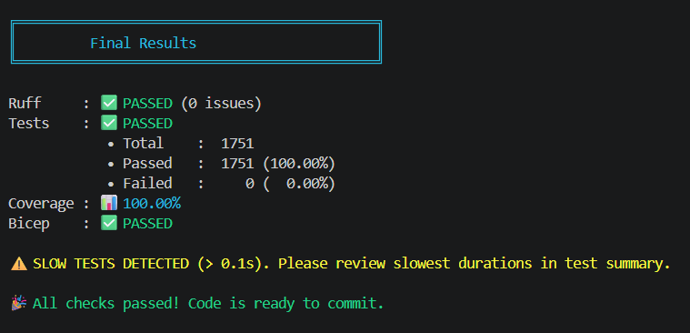
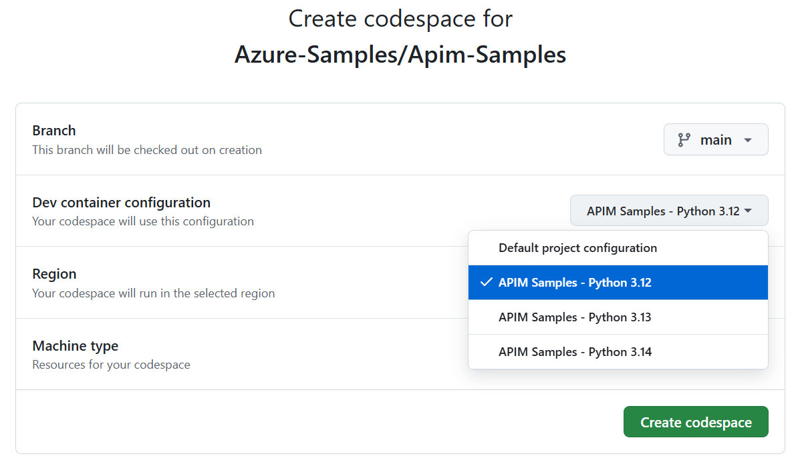

# Azure API Management Samples

[][openssf]
[![Python Tests][badge-python-tests]][workflow-python-tests]

[](https://codespaces.new/Azure-Samples/Apim-Samples?devcontainer_path=.devcontainer%2Fpython314%2Fdevcontainer.json)

**This repository provides resources to quickly deploy high-fidelity Azure API Management (APIM) infrastructures and experiment with common APIM.**

Historically, there were two general paths to experimenting with APIM: Standing up an entire landing zone with the [APIM Landing Zone Accelerator][apim-lza] can feel overwhelming and _more than needed_. Similarly, using [APIM policy snippets][apim-snippets] is only helpful when an APIM instance and infrastructure already exists.

> ⭐ _APIM Samples_ provides common APIM **_infrastructures_** and real-world **_samples_**. Most samples can be deployed to any infrastructure, yielding an **innovative and highly powerful and flexible _à la carte_ approach!**

💡 **_APIM Samples_ is _neither too much nor too little_. It is _just right_!**


## 🎯 Objectives

1. Educate on common APIM architectures we see across industries and customers.
1. Empower to safely experiment with APIM policies.
1. Provide high-fidelity building blocks to further your APIM integration efforts.


## 🚀 Getting Started

It's quick and easy to get started!

### ⚡ Quick Start (Recommended Path for First-Time Users)

1. **Choose your setup** (pick one):
   - **Easiest**: Use [GitHub Codespaces or Dev Container](#-setup) - everything is pre-configured
   - **Prefer local development**: Follow [Full Local Setup](#-setup)

2. **Deploy an infrastructure** - Choose one based on your needs:
   - **Just starting out?** → [Simple API Management][infra-simple-apim] (fastest, lowest cost)
   - **Want to explore containers?** → [API Management & Container Apps][infra-apim-aca]
   - **Exploring secure Azure Front Door?** → [Front Door & API Management with Private Link][infra-afd-apim-pe]
   - **Prefer Application Gateway?** → [Application Gateway (Private Link) & API Management][infra-appgw-apim-pe] or [Application Gateway (VNet) & API Management][infra-appgw-apim]

3. **Run a sample** - Open the desired sample's `create.ipynb` file and run it (nearly all samples work with all infrastructures)

4. **Experiment** - Modify policies, make API calls, and learn!

> 💡 **First time?** Start with the [Simple API Management][infra-simple-apim] infrastructure and the [General][sample-general] sample. It takes ~5 minutes to deploy and costs ~$1-2/hour to run.


## 📁 List of Infrastructures

<details open>

| Infrastructure Name                                                | Description                                                                                                                                                           |
|:-------------------------------------------------------------------|:----------------------------------------------------------------------------------------------------------------------------------------------------------------------|
| [Simple API Management][infra-simple-apim]                         | **Just the basics with a publicly accessible API Management instance** fronting your APIs. This is the innermost way to experience and experiment with the APIM policies. |
| [API Management & Container Apps][infra-apim-aca]                  | APIs are often implemented in containers running in **Azure Container Apps**. This architecture accesses the container apps publicly. It's beneficial to test both APIM and container app URLs to contrast and compare experiences of API calls through and bypassing APIM. It is not intended to be a security baseline.    |
| [Front Door & API Management & Container Apps][infra-afd-apim-pe]  | **A secure implementation of Azure Front Door connecting to APIM via the new private link integration!** This traffic, once it traverses through Front Door, rides entirely on Microsoft-owned and operated networks. The connection from APIM to Container Apps is secured but through a VNet configuration (it is also entirely possible to do this via private link). **APIM Standard V2** is used here to accept a private link from Front Door. |
| [Application Gateway (Private Endpoint) & API Management & Container Apps][infra-appgw-apim-pe]  | **A secure implementation of Azure Application Gateway connecting to APIM via the new private link integration!** This traffic, once it traverses through App Gateway, uses a private endpoint set up in the VNet's private endpoint subnet. The connection from APIM to Container Apps is secured but through a VNet configuration (it is also entirely possible to do this via private link). APIM Standard V2 is used here to accept a private link from App Gateway. |
| [Application Gateway (VNet) & API Management & Container Apps][infra-appgw-apim] | Full VNet injection of APIM and ACA! APIM is shielded from any type of traffic unless it comes through App Gateway. This offers maximum isolation for instances in which customers seek VNet injection. |
</details>

## 📁 List of Samples

<details open>

| Sample Name                                                 | Description                                                                                                         | Supported Infrastructure(s)   |
|:------------------------------------------------------------|:--------------------------------------------------------------------------------------------------------------------|:------------------------------|
| [AuthX][sample-authx]                                       | Authentication and role-based authorization in a mock HR API.                                                       | All infrastructures           |
| [AuthX Pro][sample-authx-pro]                               | Authentication and role-based authorization in a mock product with multiple APIs and policy fragments.              | All infrastructures           |
| [General][sample-general]                                   | Basic demo of APIM sample setup and policy usage.                                                                   | All infrastructures           |
| [Load Balancing][sample-load-balancing]                     | Priority and weighted load balancing across backends.                                                               | apim-aca, afd-apim (with ACA) |
| [Secure Blob Access][sample-secure-blob-access]             | Secure blob access via the [valet key pattern][valet-key-pattern].                                                  | All infrastructures           |
| [Credential Manager (with Spotify)][sample-oauth-3rd-party] | Authenticate with APIM which then uses its Credential Manager with Spotify's REST API.                              | All infrastructures           |
| [Azure Maps][sample-azure-maps]                             | Proxying calls to Azure Maps with APIM policies.                                                                    | All infrastructures           |
</details>


## 🧰 APIM Samples Developer CLI

Use the interactive APIM Samples Developer CLI to verify setup, run tests, and manage your development workflow:

**Windows:**
```powershell
.\start.ps1
```

**macOS / Linux:**
```bash
./start.sh
```

This menu-driven interface provides quick access to:
- **Setup**: Complete environment setup and verify local setup
- **Verify**: Show Azure account info, list soft-deleted resources, and list deployed infrastructures
- **Tests**: Run pylint, pytest, and full Python checks



> The _APIM Samples Developer CLI_ is not synonomous with the _Azure Developer CLI_. These are two separate CLIs.

## 🧭 Setup

APIM Samples supports two setup options:

### Option 1: GitHub Codespaces / Dev Container (Recommended for First-Time Users)
<details>
<br/>

[](https://codespaces.new/Azure-Samples/Apim-Samples?devcontainer_path=.devcontainer%2Fpython314%2Fdevcontainer.json)

**The fastest way to get started is using our pre-configured development environment. Just click the *Open in GitHub Codespaces* button above!** Everything is pre-installed and configured—just sign in to Azure and you're ready to go.

This is especially helpful if you're new to APIM, unfamiliar with Python environments, or want to avoid local setup complexity. **The entire setup typically takes 2-3 minutes.**

**GitHub Codespaces**: You can also go through the menu by clicking the green "Code" button → "Codespaces" → "..." → "New with options..." → "Dev container configuration" (select Python version but ignore *Default project configuration*) → "Create codespace"

📖 **For detailed setup information, troubleshooting, and optimization details, see [Codespaces Quickstart](.devcontainer/CODESPACES-QUICKSTART.md) and [Dev Container Documentation](.devcontainer/README.md)**



**VS Code Dev Containers**: Alternatively, you can run the dev container locally by installing the [Dev Containers extension][vscode-devcontainers], then selecting "Reopen in Container".

1. Open the repository in the dev container environment
2. Wait for the automatic setup to complete (includes interactive Azure CLI configuration)
3. If prompted during setup, choose your preferred Azure CLI authentication method:
   - **Mount local config**: Preserves authentication between container rebuilds
   - **Manual login**: Requires tenant-specific `az login` after each container startup
   - **Configure later**: Skip for now, configure manually later
4. **Sign in to Azure with correct tenant and subscription**:
   - If you chose manual login or skipped: `az login --tenant <your-tenant-id-or-domain>`
   - Set the correct subscription: `az account set --subscription <your-subscription-id-or-name>`
   - Verify your authentication context: `az account show`
5. Verify your Azure setup by executing [shared/jupyter/verify-az-account.ipynb](shared/jupyter/verify-az-account.ipynb)

All prerequisites are automatically installed and configured.

</details>

### Option 2: Full Local Setup
<details>

#### 📋 Prerequisites

These prerequisites apply broadly across all infrastructure and samples. If there are specific deviations, expect them to be noted there.

- [Python][python] **3.12, 3.13, and 3.14 are all supported**
- **uv** (https://docs.astral.sh/uv/) - Fast Python package manager
   - Install uv:
      - **Windows**: `winget install --id=astral-sh.uv -e` or `scoop install uv`
      - **macOS**: `brew install uv` or `curl -LsSf https://astral.sh/uv/install.sh | sh`
      - **Linux**: `curl -LsSf https://astral.sh/uv/install.sh | sh`
   - If needed, restart VS Code for path to become effective.
   - Verify: `uv --version`
- [VS Code][vscode] installed with the [Jupyter notebook extension][vscode-jupyter] enabled
- [Azure CLI][azure-cli-install] installed
- [Azure Bicep][azure-bicep-install] installed
- [An Azure Subscription][azure-free] with Owner or Contributor+UserAccessAdministrator permissions. Execute [Verify Azure Account][verify-az-account-notebook] to verify.
- **Azure Authentication**: Sign in to Azure with Azure CLI using the specific tenant and subscription you want to work with:
  - To log in to a specific tenant: `az login --tenant <your-tenant-id-or-domain>`
  - To set a specific subscription: `az account set --subscription <your-subscription-id-or-name>`
  - To verify your current context: `az account show`
   - See the [Azure CLI authentication guide][azure-cli-auth] for more options

#### Manual Local Setup

1. **Create Python Environment**:

   ```bash
   uv venv
   uv sync
   ```

   Be sure to activate the terminal as per the instruction after `uv venv` runs.

   Alternatively, you can use VS Code: Ctrl+Shift+P → "Python: Create Environment" → "Venv" → Select Python version → name: .venv. Then run `uv sync` to install dependencies.
1. **Complete Environment Setup**: Open a terminal and start the [APIM Samples Developer CLI](#-apim-samples-developer-cli), then select `Complete environment setup`.
3. **Restart VS Code** to apply all settings
4. **Sign in to Azure**: `az login --tenant <your-tenant-id>` and `az account set --subscription <your-subscription>`
5. **Verify local setup**: Start the APIM Samples Developer CLI, then select `Verify local setup`.

The first time you run a Jupyter notebook, you may be asked to install the Jupyter kernel package (ipykernel) if not already available.
When you open any `.ipynb` notebook, it will automatically use the correct kernel and all imports will work seamlessly.
</details>

## 🚀 Sample Deployments

1. Open the desired sample's `create.ipynb` file.
1. Optional: Adjust the parameters under the `User-defined Parameters` header, if desired.
1. Execute the `create.ipynb` Jupyter notebook via `Run All`.

> A supported infrastructure does not yet need to exist before the sample is executed. The notebook will determine the current state and present you with options to create or select a supported infrastructure, if necessary.

Now that infrastructure and sample have been stood up, you can experiment with the policies, make requests against APIM, etc.


## 🔎 Logging and Output

The Python helpers in this repo use standard-library `logging`, empowering you to control verbosity via environment variables in the root `.env` file. This file is created via the APIM Samples Developer CLI.

- `APIM_SAMPLES_LOG_LEVEL`: Controls the overall verbosity (`DEBUG`, `INFO`, `WARNING`, `ERROR`, `CRITICAL`). Default: `INFO`.
   - When set to `DEBUG`, the Azure CLI runner in [shared/python/azure_resources.py](shared/python/azure_resources.py) will also add `--debug` to simple `az ...` commands.
- `APIM_SAMPLES_CONSOLE_WIDTH`: Optional wrap width for long lines (defaults to `120`).


## Troubleshooting

Encountering issues? Check our comprehensive **[Troubleshooting Guide](troubleshooting)**! which covers:

- **Deployment Errors** - Including the common "content already consumed" error and parameter mismatches
- **Authentication Issues** - Azure CLI login problems and permission errors
- **Notebook & Development Environment Issues** - Module import errors and Python path problems
- **Azure CLI Issues** - Rate limiting and API version compatibility
- **Resource Management Issues** - Resource group and APIM service problems

For immediate help with common errors, diagnostic commands, and step-by-step solutions, see **[TROUBLESHOOTING.md][troubleshooting]**.


## 📂 Repo Structure

### 🦅 High-level

- All _samples_ can be found in the `samples` folder. Samples showcase functionality and provide a baseline for your experimentation.
- All _infrastructures_ can be found in the `infrastructure` folder. They provide the architectural underpinnings.
- All shared code, modules, functionality, policies, etc. can be found in the `shared` folder.
  - Bicep _modules_ are versioned in the `bicep/modules` folder. Major changes require versioning.
  - Python _modules_ are found in the `python` folder. _They are not versioned yet but may be in the future._
  - Reusable _APIM policies_ are found in the `apim-policies` folder.
  - Reusable Jupyter notebooks are found in the `jupyter` folder.

### 🔧 Sample Setup

- Each sample uses an architecture infrastructure. This keeps the samples free of almost all setup.
- Each infrastructure and sample features a `create.ipynb` for creation (and running) of the sample setup and a `main.bicep` file for IaC configuration.
- Each infrastructure contains a `clean-up.ipynb` file to tear down everything in the infrastructure and its resource group. This reduces your Azure cost.
- Samples (and infrastructures) may contain additional files specific to their use cases.

### 🗺 Infrastructure Architectures

We provide several common architectural approaches to integrating APIM into your Azure ecosystem. While these are high-fidelity setups, they are not production-ready. Please refer to the [Azure API Management landing zone accelerator][apim-lza] for up-to-date production setups.

## 🧪 Development

As you work with this repo, you will likely want to make your own customizations. There's little you need to know to be successful.

The repo uses the bicep linter and has rules defined in `bicepconfig.json`. See the [bicep linter documentation][bicep-linter-docs] for details.

**We welcome contributions!** Please consider forking the repo and creating issues and pull requests to share your samples. Please see [CONTRIBUTING.md](CONTRIBUTING.md) for details. Thank you!

### 🔍 Code Quality & Linting

The repository uses [pylint][pylint-docs] to maintain Python code quality standards. The configuration is located in `.pylintrc`, and the APIM Samples Developer CLI supports linting.

### 🧪 Testing & Code Coverage

Python modules in `shared/python` are covered by comprehensive unit tests located in `tests/python`. All tests use [pytest][pytest-docs] and leverage modern pytest features, including custom markers for unit and HTTP tests. The APIM Samples Developer CLI supports testing.

### ➕ Adding a Sample

Adding a new sample is relatively straight-forward.

1. Create a new feature branch for the new sample.
1. Copy the `/samples/_TEMPLATE` folder.
1. Rename the copied folder to a name representative of the sample (e.g. "load-balancing", "authX", etc.)
1. Change the `create.ipynb` and `main.bicep` files. Look for the brackets (`[ ]`) brackets for specific inputs.
1. Add any policy.xml files to the same folder if they are specific to this sample. If they are to be reused, place them into the `/shared/apim-policies` folder instead.
1. Test the sample with all supported infrastructures.
1. Create a pull request for merge.


## 🙏 Acknowledgements

This project has its roots in work done by [Alex Vieira][alex-vieira] on the excellent Azure API Management [AI Gateway][ai-gateway] GitHub repository. Much of the structure is similar and its reuse resulted in significant time savings. Thank you, Alex!

Furthermore, [Houssem Dellai][houssem-dellai] was instrumental in setting up a working Front Door to API Management [private connectivity lab][ai-gateway-private-connectivity]. This created a working baseline for one of this repository's infrastructures. Thank you, Houssem!

[Andrew Redman][andrew-redman] for contributing the _Azure Maps_ sample.

The original author of this project is [Simon Kurtz][simon-kurtz].


## 🥇 Other resources

- [AI Gateway][ai-gateway]
- [Landing Zone Accelerator](https://learn.microsoft.com/en-us/azure/cloud-adoption-framework/scenarios/app-platform/api-management/landing-zone-accelerator#generative-ai-gateway-scenario)
- [Learning Modules](https://learn.microsoft.com/en-us/training/browse/?products=azure-api-management)
- [News and announcements](https://techcommunity.microsoft.com/tag/API%20Management?nodeId=board%3AIntegrationsonAzureBlog)
- [APIM Releases](https://github.com/Azure/API-Management/releases)
- [APIM policy snippets repo][apim-snippets]

_For much more API Management content, please also check out [APIM Love](https://aka.ms/apimlove)._


## 📜 Disclaimer

> [!IMPORTANT]
> This software is provided for demonstration purposes only. It is not intended to be relied upon for any purpose. The creators of this software make no representations or warranties of any kind, express or implied, about the completeness, accuracy, reliability, suitability or availability with respect to the software or the information, products, services, or related graphics contained in the software for any purpose. Any reliance you place on such information is therefore strictly at your own risk.


[ai-gateway]: https://github.com/Azure-Samples/AI-Gateway
[ai-gateway-private-connectivity]: https://github.com/Azure-Samples/AI-Gateway/tree/main/labs/private-connectivity
[alex-vieira]: https://github.com/vieiraae
[andrew-redman]: https://github.com/anotherRedbeard
[apim-love]: https://aka.ms/apimlove
[apim-lza]: https://learn.microsoft.com/azure/cloud-adoption-framework/scenarios/app-platform/api-management/landing-zone-accelerator
[apim-snippets]: https://github.com/Azure/api-management-policy-snippets
[azure-bicep-install]: https://learn.microsoft.com/azure/azure-resource-manager/bicep/install#azure-cli
[azure-cli-auth]: https://learn.microsoft.com/cli/azure/authenticate-azure-cli-interactively
[azure-cli-install]: https://learn.microsoft.com/cli/azure/install-azure-cli
[azure-free]: https://azure.microsoft.com/free/
[badge-python-tests]: https://github.com/Azure-Samples/Apim-Samples/actions/workflows/python-tests.yml/badge.svg?branch=main
[bicep-linter-docs]: https://learn.microsoft.com/azure/azure-resource-manager/bicep/bicep-config-linter
[houssem-dellai]: https://github.com/HoussemDellai
[import-troubleshooting]: .devcontainer/IMPORT-TROUBLESHOOTING.md
[infra-afd-apim-pe]: ./infrastructure/afd-apim-pe
[infra-apim-aca]: ./infrastructure/apim-aca
[infra-appgw-apim]: ./infrastructure/appgw-apim/
[infra-appgw-apim-pe]: ./infrastructure/appgw-apim-pe/
[infra-simple-apim]: ./infrastructure/simple-apim
[openssf]: https://www.bestpractices.dev/projects/11057
[pytest-docs]: https://docs.pytest.org/
[pytest-docs-versioned]: https://docs.pytest.org/en/8.2.x/
[pylint-docs]: https://pylint.pycqa.org/
[python]: https://www.python.org/
[sample-authx]: ./samples/authX/README.md
[sample-authx-pro]: ./samples/authX-pro/README.md
[sample-azure-maps]: ./samples/azure-maps/README.md
[sample-general]: ./samples/general/README.md
[sample-load-balancing]: ./samples/load-balancing/README.md
[sample-oauth-3rd-party]: ./samples/oauth-3rd-party/README.md
[sample-secure-blob-access]: ./samples/secure-blob-access/README.md
[simon-kurtz]: https://github.com/simonkurtz-msft
[troubleshooting]: TROUBLESHOOTING.md
[valet-key-pattern]: https://learn.microsoft.com/azure/architecture/patterns/valet-key
[verify-az-account-notebook]: shared/jupyter/verify-az-account.ipynb
[vscode]: https://code.visualstudio.com/
[vscode-devcontainers]: https://marketplace.visualstudio.com/items?itemName=ms-vscode-remote.remote-containers
[vscode-jupyter]: https://marketplace.visualstudio.com/items?itemName=ms-toolsai.jupyter
[workflow-python-tests]: https://github.com/Azure-Samples/Apim-Samples/actions/workflows/python-tests.yml
