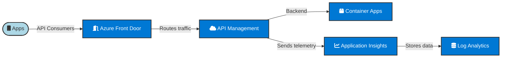

# Azure Front Door, API Management & Container Apps Architecture

```mermaid
flowchart LR
    apps([fa:fa-mobile Apps]):::appStyle
    afd[fa:fa-door-open Azure Front Door]:::azureStyle
    apim[fa:fa-cloud API Management]:::azureStyle
    aca[fa:fa-box Container Apps]:::azureStyle
    appinsights[fa:fa-chart-line Application Insights]:::azureStyle
    loganalytics[fa:fa-database Log Analytics]:::azureStyle

    apps -->|API Consumers| afd
    afd -->|Routes traffic| apim
    apim -->|Backend| aca
    apim -->|Sends telemetry| appinsights
    appinsights -->|Stores data| loganalytics

    classDef appStyle fill:#ADD8E6,stroke:#333,stroke-width:2px
    classDef azureStyle fill:#0078D4,stroke:#333,stroke-width:2px,color:#fff
```
