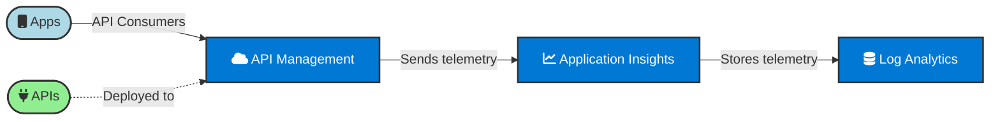

# Simple API Management Architecture

```mermaid
flowchart LR
    apps([fa:fa-mobile Apps]):::appStyle
    apis([fa:fa-plug APIs]):::apiStyle
    apim[fa:fa-cloud API Management]:::azureStyle
    appinsights[fa:fa-chart-line Application Insights]:::azureStyle
    loganalytics[fa:fa-database Log Analytics]:::azureStyle

    apps -->|API Consumers| apim
    apis -.->|Deployed to| apim
    apim -->|Sends telemetry| appinsights
    appinsights -->|Stores telemetry| loganalytics

    classDef appStyle fill:#ADD8E6,stroke:#333,stroke-width:2px
    classDef apiStyle fill:#90EE90,stroke:#333,stroke-width:2px
    classDef azureStyle fill:#0078D4,stroke:#333,stroke-width:2px,color:#fff
```
