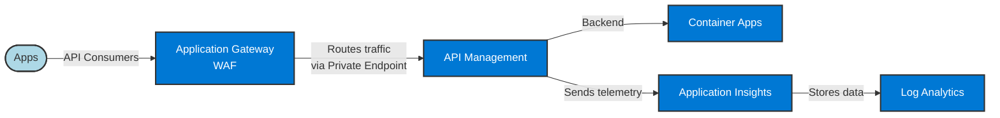

# Azure Application Gateway, API Management & Container Apps Architecture

```mermaid
flowchart LR
    apps([Apps]):::appStyle
    appgw[Application Gateway<br/>WAF]:::azureStyle
    apim[API Management]:::azureStyle
    aca[Container Apps]:::azureStyle
    appinsights[Application Insights]:::azureStyle
    loganalytics[Log Analytics]:::azureStyle

    apps -->|API Consumers| appgw
    appgw -->|Routes traffic<br/>via Private Endpoint| apim
    apim -->|Backend| aca
    apim -->|Sends telemetry| appinsights
    appinsights -->|Stores data| loganalytics

    classDef appStyle fill:#ADD8E6,stroke:#333,stroke-width:2px
    classDef azureStyle fill:#0078D4,stroke:#333,stroke-width:2px,color:#fff
```
