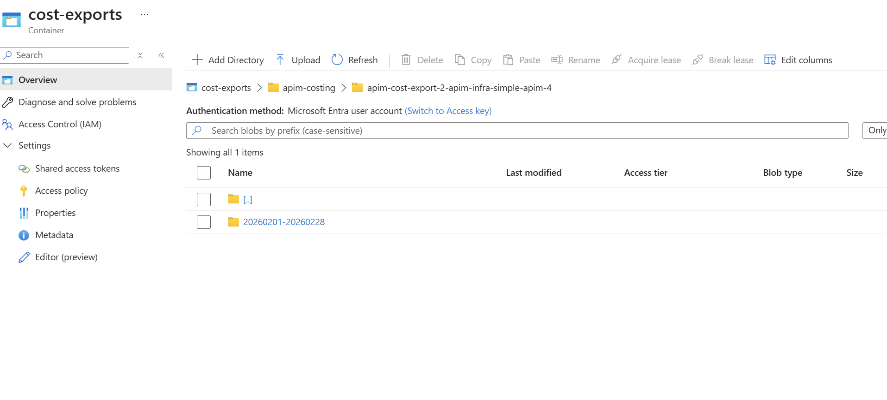
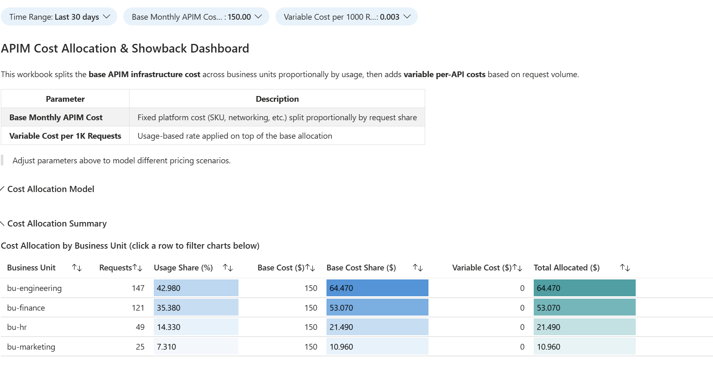
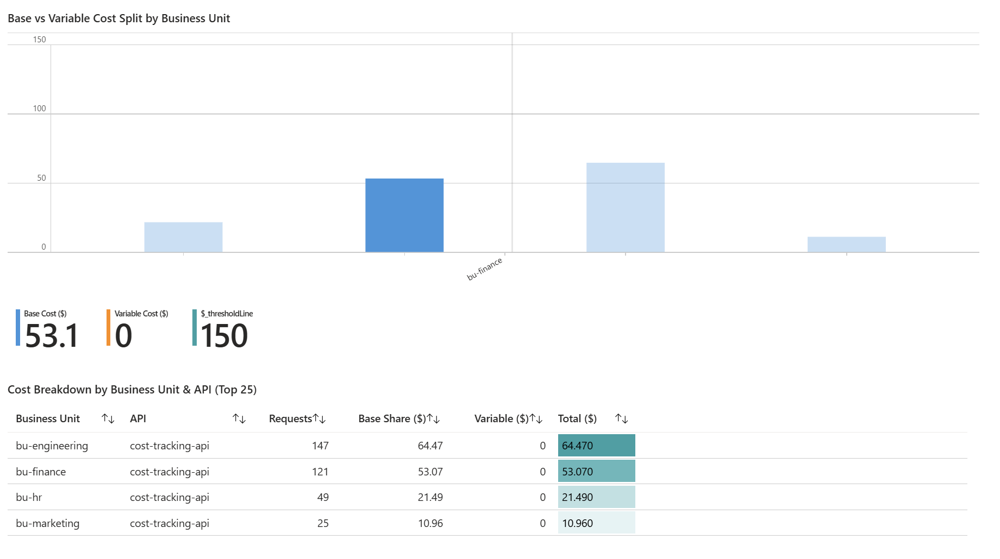
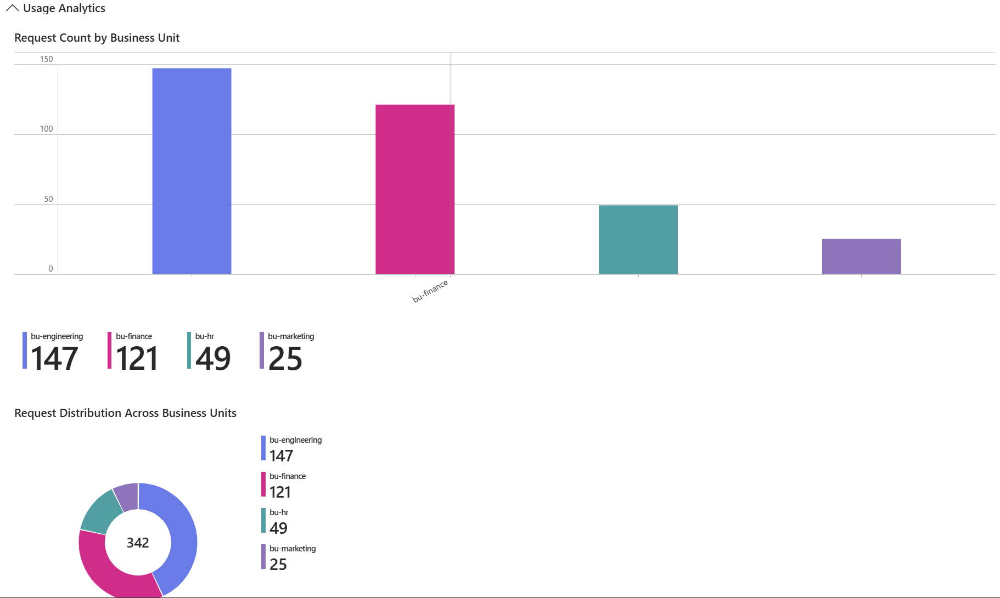
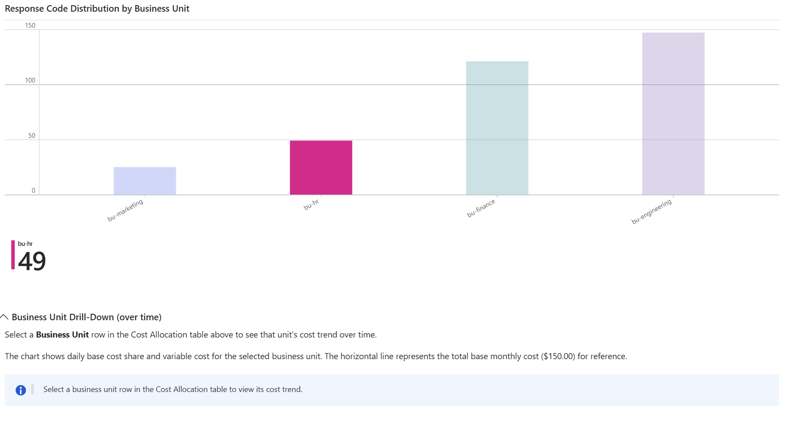

# Samples: APIM Costing & Showback

This sample demonstrates how to track and allocate API costs using Azure API Management with Azure Monitor, Application Insights, Log Analytics, and Cost Management. This setup enables organizations to determine the cost of API consumption per business unit, department, or application.

⚙️ **Supported infrastructures**: All infrastructures (or bring your own existing APIM deployment)

👟 **Expected *Run All* runtime (excl. infrastructure prerequisite): ~15 minutes**

## 🎯 Objectives

1. **Track API usage by caller** - Use APIM subscription keys to identify business units, departments, or applications
2. **Capture request metrics** - Log subscriptionId, apiName, operationName, and status codes
3. **Aggregate cost data** - Combine API usage metrics with Azure Cost Management data
4. **Visualize showback data** - Create Azure Monitor Workbooks to display cost allocation by caller
5. **Enable cost governance** - Establish patterns for consistent tagging and naming conventions

## ✅ Prerequisites

Before running this sample, ensure you have the following:

### Required

| Prerequisite | Description |
|---|---|
| **Azure subscription** | An active Azure subscription with Owner or Contributor access |
| **Azure CLI** | Logged in (`az login`) with the correct subscription selected (`az account set -s <id>`) |
| **APIM instance** | Either deploy one via this repo's infrastructure, or bring your own (see below) |
| **Python environment** | Python 3.12+ with dependencies installed (`uv sync` or `pip install -r requirements.txt`) |

### Azure RBAC Permissions

The signed-in user needs the following role assignments:

| Role | Scope | Purpose |
|---|---|---|
| **Contributor** | Resource Group | Deploy Bicep resources (App Insights, Log Analytics, Storage, Workbook, Diagnostic Settings) |
| **Cost Management Contributor** | Subscription | Create Cost Management export |
| **Storage Blob Data Contributor** | Storage Account | Write cost export data (auto-assigned by the notebook) |

### For Workbook Consumers

Users who only need to **view** the deployed Azure Monitor Workbook (not deploy the sample) need:

| Role | Scope | Purpose |
|---|---|---|
| **Monitoring Reader** | Resource Group | Open and view the workbook |
| **Log Analytics Reader** | Log Analytics Workspace | Execute the Kusto queries that power the workbook |

> 💡 If a user can open the workbook but sees empty visualizations, they are likely missing **Log Analytics Reader** on the workspace.

## ⚙️ Configuration

### Important: Sample Index

The `create.ipynb` notebook passes a **`sampleIndex` parameter** to the Bicep template. This parameter ensures unique resource naming when deploying multiple instances of this sample. The notebook automatically provides this value; you only need to verify it matches your deployment scenario:

```python
sample_index = 2  # Increment this for multiple sample deployments
```

This index is used in resource names (e.g., `appi-cost-2-xxxx`, `log-cost-2-xxxx`) to avoid naming conflicts when running multiple instances of the sample.

### Option A: Use a repository infrastructure (recommended)

1. Navigate to the desired [infrastructure](../../infrastructure/) folder (e.g., [simple-apim](../../infrastructure/simple-apim/)) and follow its README.md to deploy.
2. Open `create.ipynb` and set:
   ```python
   infrastructure = INFRASTRUCTURE.SIMPLE_APIM  # Match your deployed infra
   index = 1                                     # Match your infra index
   sample_index = 1                              # Increment for multiple sample deployments
   ```
3. Run All Cells.

### Option B: Bring your own existing APIM

You can use any existing Azure API Management instance. The sample only adds diagnostic settings and sample resources to your APIM - it does **not** modify your existing APIs or policies.

1. Open `create.ipynb` and **uncomment** the two lines in the User Configuration section:
   ```python
   existing_rg_name = 'your-resource-group-name'
   existing_apim_name = 'your-apim-service-name'
   ```
2. Set the correct Azure subscription: `az account set -s <subscription-id>`
3. Run All Cells.

**What the sample deploys into your resource group:**
- Application Insights instance
- Log Analytics Workspace
- Storage Account (for cost exports)
- Diagnostic Settings on your APIM (routes gateway logs to Log Analytics)
- Azure Monitor Workbook
- A sample API (`cost-tracking-api`) with 5 business unit subscriptions

**What it does NOT touch:**
- Your existing APIs, policies, or subscriptions
- Your APIM SKU or networking configuration
- Any resources outside the specified resource group (except the subscription-scoped Cost Management export)

## 📝 Scenario

Organizations often need to allocate the cost of shared API Management infrastructure to different consumers (business units, departments, applications, or customers). This sample addresses:

- **Cost Transparency**: Understanding which teams or applications drive API consumption
- **Chargeback/Showback**: Producing data that can inform internal billing or cost awareness
- **Resource Optimization**: Identifying high-cost consumers and opportunities for optimization
- **Budget Planning**: Historical usage patterns to forecast future costs

### Key Principle: Cost Determination, Not Billing

This sample focuses on **producing cost data**, not implementing billing processes. You determine costs; how you use that information (showback reports, chargeback, budgeting) is a separate business decision.

## 🛩️ Lab Components

This lab deploys and configures:

- **Application Insights** - Receives APIM diagnostic logs for request tracking
- **Log Analytics Workspace** - Stores `ApiManagementGatewayLogs` with detailed request metadata (resource-specific mode)
- **Storage Account** - Receives Azure Cost Management exports
- **Cost Management Export** - Automated export of cost data (configurable frequency)
- **Diagnostic Settings** - Links APIM to Log Analytics with `logAnalyticsDestinationType: Dedicated` for resource-specific tables
- **Sample API & Subscriptions** - 5 subscriptions representing different business units
- **Azure Monitor Workbook** - Pre-built dashboard with:
  - Cost allocation table (base + variable cost per BU)
  - Base vs variable cost stacked bar chart
  - Cost breakdown by API
  - Request count and distribution charts
  - Success/error rate analysis
  - Response code distribution
- **Live Pricing Integration** - Auto-detects your APIM SKU and fetches current pricing from the [Azure Retail Prices API](https://learn.microsoft.com/rest/api/cost-management/retail-prices/azure-retail-prices)
- **Budget Alerts** (optional) - Per-BU scheduled query alerts when request thresholds are exceeded

### Cost Allocation Model

| Component | Formula |
|---|---|
| **Base Cost Share** | `Base Monthly Cost x (BU Requests / Total Requests)` |
| **Variable Cost** | `BU Requests x (Rate per 1K / 1000)` |
| **Total Allocated** | `Base Cost Share + Variable Cost` |

### What Gets Logged

| Field | Description |
|---|---|
| `ApimSubscriptionId` | Identifies the caller (BU / department / app) |
| `ApiId` | Which API was called |
| `OperationId` | Specific operation within the API |
| `ResponseCode` | Success / failure indication |
| Request count | Number of requests (primary cost metric) |

> **Important**: The API must have `subscriptionRequired: true` for `ApimSubscriptionId` to be populated in logs. This sample configures it automatically.

## 🖼️ Expected Results

After running the notebook, you will have:

1. **Application Insights** showing real-time API requests
2. **Log Analytics** with queryable `ApiManagementGatewayLogs` (resource-specific table)
3. **Storage Account** receiving cost export data
4. **Azure Monitor Workbook** displaying cost allocation and usage analytics
5. **Portal links** printed in the notebook's final cell for quick access

### Cost Management Export

The cost export is configured automatically using a system-assigned managed identity with **Storage Blob Data Contributor** access.




### Azure Monitor Workbook Dashboard

The deployed workbook provides a comprehensive view of API cost allocation and usage analytics across business units.










## 🧹 Clean Up

To remove all resources created by this sample, open and run `clean-up.ipynb`. This deletes:
- Sample API and subscriptions from APIM
- Application Insights, Log Analytics, Storage Account
- Azure Monitor Workbook
- Cost Management export

> The clean-up notebook does **not** delete your APIM instance or resource group.

## 🔗 Additional Resources

- [Azure API Management Pricing](https://azure.microsoft.com/pricing/details/api-management/)
- [Azure Retail Prices API](https://learn.microsoft.com/rest/api/cost-management/retail-prices/azure-retail-prices)
- [Azure Cost Management Documentation](https://learn.microsoft.com/azure/cost-management-billing/)
- [Log Analytics Kusto Query Language](https://learn.microsoft.com/azure/data-explorer/kusto/query/)
- [Azure Monitor Workbooks](https://learn.microsoft.com/azure/azure-monitor/visualize/workbooks-overview)
- [APIM Diagnostic Settings](https://learn.microsoft.com/azure/api-management/api-management-howto-use-azure-monitor)

[infrastructure-architectures]: ../../README.md#infrastructure-architectures
[infrastructure-folder]: ../../infrastructure/
[simple-apim-infra]: ../../infrastructure/simple-apim/
