# Samples: APIM Costing & Showback

This sample demonstrates how to track and allocate API costs using Azure API Management with Azure Monitor, Application Insights, Log Analytics, and Cost Management. It supports three complementary approaches: **subscription-based** tracking (using APIM subscription keys), **Entra ID application** tracking (using the `emit-metric` policy with JWT `appid` claims), and **AI Gateway token/PTU** tracking (using the `emit-metric` policy to capture per-client token consumption when APIM acts as an AI Gateway). All approaches share a single Azure Monitor Workbook with tabbed views.

⚙️ **Supported infrastructures**: All infrastructures (or bring your own existing APIM deployment)

👟 **Expected *Run All* runtime (excl. infrastructure prerequisite): ~15 minutes**

## 🎯 Objectives

1. **Track API usage by caller** - Use APIM subscription keys to identify business units, departments, or applications
2. **Track API usage by Entra ID application** - Use the `emit-metric` policy to extract `appid`/`azp` JWT claims and emit per-caller custom metrics
3. **Capture request metrics** - Log subscriptionId, apiName, operationName, and status codes
4. **Aggregate cost data** - Combine API usage metrics with Azure Cost Management data
5. **Visualize showback data** - Create Azure Monitor Workbooks with tabbed views for both approaches
6. **Enable cost governance** - Establish patterns for consistent tagging and naming conventions
7. **Enable budget alerts** - Create scheduled query alerts when callers exceed configurable thresholds
8. **Track AI token consumption per client** - When APIM is used as an AI Gateway, capture prompt, completion, and total token usage per calling application, enabling per-client cost attribution for PTU or pay-as-you-go OpenAI deployments

## ✅ Prerequisites

Before running this sample, ensure you have the following:

### Required

| Prerequisite | Description |
|---|---|
| **Azure subscription** | An active Azure subscription with Owner or Contributor access |
| **Azure CLI** | Logged in (`az login`) with the correct subscription selected (`az account set -s <id>`) |
| **APIM instance** | Either deploy one via this repo's infrastructure, or bring your own (see below) |
| **Python environment** | Python 3.12+ with dependencies installed (`uv sync` or `pip install -r requirements.txt`) |

### Azure RBAC Permissions

The signed-in user needs the following role assignments:

| Role | Scope | Purpose |
|---|---|---|
| **Contributor** | Resource Group | Deploy Bicep resources (App Insights, Log Analytics, Storage, Workbook, Diagnostic Settings) |
| **Cost Management Contributor** | Subscription | Create Cost Management export |
| **Storage Blob Data Contributor** | Storage Account | Write cost export data (auto-assigned by the notebook) |

### For Workbook Consumers

Users who only need to **view** the deployed Azure Monitor Workbook (not deploy the sample) need:

| Role | Scope | Purpose |
|---|---|---|
| **Monitoring Reader** | Resource Group | Open and view the workbook |
| **Log Analytics Reader** | Log Analytics Workspace | Execute the Kusto queries that power the workbook |

> 💡 If a user can open the workbook but sees empty visualizations, they are likely missing **Log Analytics Reader** on the workspace.

## ⚙️ Configuration

### Important: Sample Index

The `create.ipynb` notebook passes a **`sampleIndex` parameter** to the Bicep template. This parameter ensures unique resource naming when deploying multiple instances of this sample. The notebook automatically provides this value; you only need to verify it matches your deployment scenario:

```python
sample_index = 2  # Increment this for multiple sample deployments
```

This index is used in resource names (e.g., `appi-cost-2-xxxx`, `log-cost-2-xxxx`) to avoid naming conflicts when running multiple instances of the sample.

### Option A: Use a repository infrastructure (recommended)

1. Navigate to the desired [infrastructure](../../infrastructure/) folder (e.g., [simple-apim](../../infrastructure/simple-apim/)) and follow its README.md to deploy.
2. Open `create.ipynb` and set:
   ```python
   infrastructure = INFRASTRUCTURE.SIMPLE_APIM  # Match your deployed infra
   index = 1                                     # Match your infra index
   sample_index = 1                              # Increment for multiple sample deployments
   ```
3. Run All Cells.

### Option B: Bring your own existing APIM

You can use any existing Azure API Management instance. The sample only adds diagnostic settings and sample resources to your APIM - it does **not** modify your existing APIs or policies.

1. Open `create.ipynb` and **uncomment** the two lines in the User Configuration section:
   ```python
   existing_rg_name = 'your-resource-group-name'
   existing_apim_name = 'your-apim-service-name'
   ```
2. Set the correct Azure subscription: `az account set -s <subscription-id>`
3. Run All Cells.

**What the sample deploys into your resource group:**
- Application Insights instance
- Log Analytics Workspace
- Storage Account (for cost exports)
- Diagnostic Settings on your APIM (routes gateway logs to Log Analytics)
- Azure Monitor Workbook
- A sample API (`cost-tracking-api`) with 5 business unit subscriptions

**What it does NOT touch:**
- Your existing APIs, policies, or subscriptions
- Your APIM SKU or networking configuration
- Any resources outside the specified resource group (except the subscription-scoped Cost Management export)

## 📝 Scenario

Organizations often need to allocate the cost of shared API Management infrastructure to different consumers (business units, departments, applications, or customers). This sample addresses:

- **Cost Transparency**: Understanding which teams or applications drive API consumption
- **Chargeback/Showback**: Producing data that can inform internal billing or cost awareness
- **Resource Optimization**: Identifying high-cost consumers and opportunities for optimization
- **Budget Planning**: Historical usage patterns to forecast future costs

### Key Principle: Cost Determination, Not Billing

This sample focuses on **producing cost data**, not implementing billing processes. You determine costs; how you use that information (showback reports, chargeback, budgeting) is a separate business decision.

### Two Tracking Approaches

| Aspect | Subscription-Based | Entra ID Application | AI Gateway Token/PTU |
|---|---|---|---|
| **Caller identification** | APIM subscription key (`ApimSubscriptionId`) | JWT `appid`/`azp` claim | JWT `appid`/`azp` claim |
| **Data source** | `ApiManagementGatewayLogs` in Log Analytics | `customMetrics` in Application Insights | `customMetrics` in Application Insights |
| **Tracking mechanism** | Built-in APIM logging | `emit-metric` policy | `emit-metric` policy (outbound response parsing) |
| **Metric name** | N/A (built-in logs) | `caller-requests` | `caller-tokens` |
| **Cost Management export** | Yes (storage account) | No (metrics-based) | No (metrics-based) |
| **Best for** | Dedicated subscriptions per BU | OAuth client-credentials flows, shared subscriptions | AI Gateway scenarios (Azure OpenAI, PTU capacity planning) |

All three approaches are deployed together. Toggle `enable_entraid_tracking` and `enable_token_tracking` in the notebook to include or exclude each flow.

## 🛩️ Lab Components

This lab deploys and configures:

- **Application Insights** - Receives APIM diagnostic logs for request tracking
- **Log Analytics Workspace** - Stores `ApiManagementGatewayLogs` with detailed request metadata (resource-specific mode)
- **Storage Account** - Receives Azure Cost Management exports
- **Cost Management Export** - Automated export of cost data (configurable frequency)
- **Diagnostic Settings** - Links APIM to Log Analytics with `logAnalyticsDestinationType: Dedicated` for resource-specific tables
- **Sample API & Subscriptions** - 4 subscriptions representing different business units
- **Entra ID Tracking API** (optional) - A second API with the `emit-metric` policy that extracts `appid` from JWT tokens and emits `caller-requests` custom metrics
- **AI Gateway Token Tracking API** (optional) - A third API with the `emit-metric` policy that parses Azure OpenAI response bodies to extract `prompt_tokens`, `completion_tokens`, and `total_tokens`, emitting `caller-tokens` custom metrics with `CallerId`, `TokenType`, and `Model` dimensions
- **Azure Monitor Workbook** - Pre-built tabbed dashboard with:
  - **Subscription-Based Costing tab**: Cost allocation table (base + variable cost per BU), base vs variable cost stacked bar chart, cost breakdown by API, request count and distribution charts, success/error rate analysis, response code distribution, business unit drill-down
  - **Entra ID Application Costing tab**: Usage by caller ID (bar chart + table), cost allocation by caller (table + pie chart), hourly request trend by caller
  - **AI Gateway Token/PTU tab**: Token consumption by client (prompt vs completion bar chart), token cost allocation table with configurable per-1K-token rates, token/cost distribution pie charts, hourly token trend with PTU capacity threshold line, prompt vs completion area chart, model breakdown table
- **Live Pricing Integration** - Auto-detects your APIM SKU and fetches current pricing from the [Azure Retail Prices API](https://learn.microsoft.com/rest/api/cost-management/retail-prices/azure-retail-prices)
- **Budget Alerts** (optional) - Per-BU scheduled query alerts when request thresholds are exceeded

### Cost Allocation Model

| Component | Formula |
|---|---|
| **Base Cost Share** | `Base Monthly Cost x (BU Requests / Total Requests)` |
| **Variable Cost** | `BU Requests x (Rate per 1K / 1000)` |
| **Total Allocated** | `Base Cost Share + Variable Cost` |

### What Gets Logged

| Field | Description |
|---|---|
| `ApimSubscriptionId` | Identifies the caller (BU / department / app) |
| `ApiId` | Which API was called |
| `OperationId` | Specific operation within the API |
| `ResponseCode` | Success / failure indication |
| Request count | Number of requests (primary cost metric) |

> **Important**: The API must have `subscriptionRequired: true` for `ApimSubscriptionId` to be populated in logs. This sample configures it automatically.

## 🖼️ Expected Results

After running the notebook, you will have:

1. **Application Insights** showing real-time API requests and `caller-requests` custom metrics (Entra ID)
2. **Log Analytics** with queryable `ApiManagementGatewayLogs` (resource-specific table)
3. **Storage Account** receiving cost export data
4. **Azure Monitor Workbook** with tabbed views for both subscription-based and Entra ID cost allocation
5. **Portal links** printed in the notebook's final cell for quick access

### Cost Management Export

The cost export is configured automatically using a system-assigned managed identity with **Storage Blob Data Contributor** access.

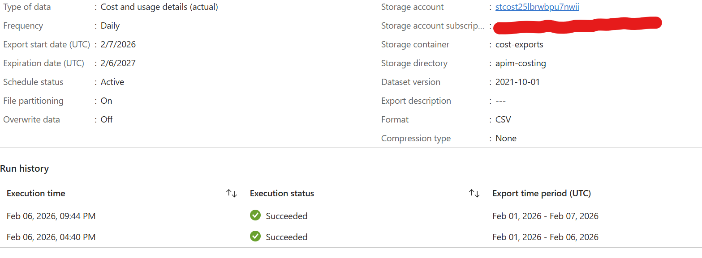

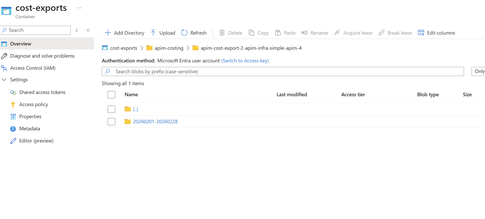

### Azure Monitor Workbook Dashboard

The deployed workbook provides a comprehensive view of API cost allocation and usage analytics across business units.

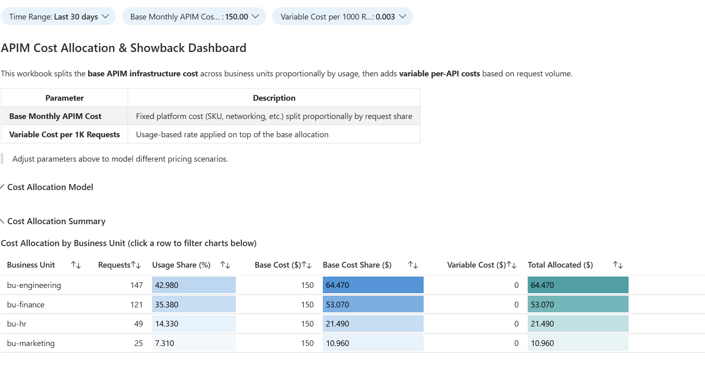

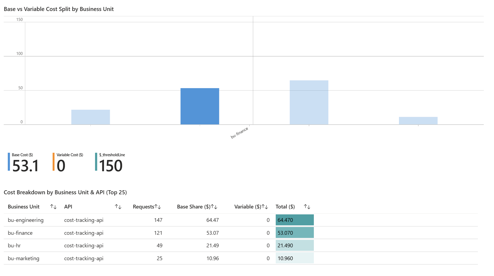

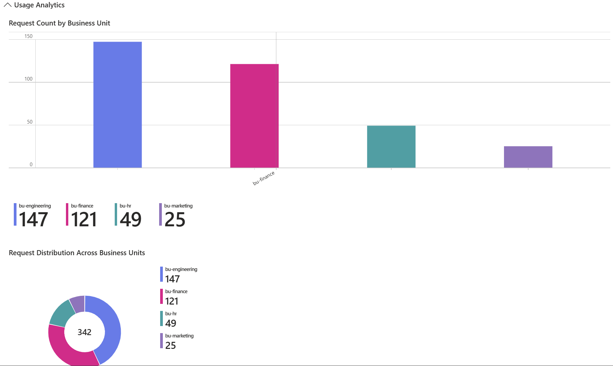

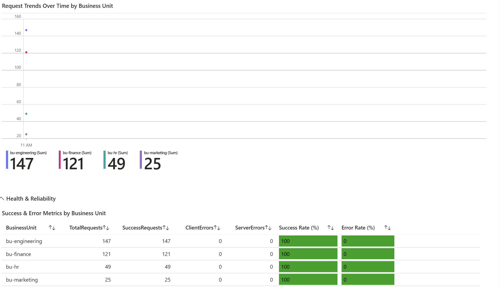

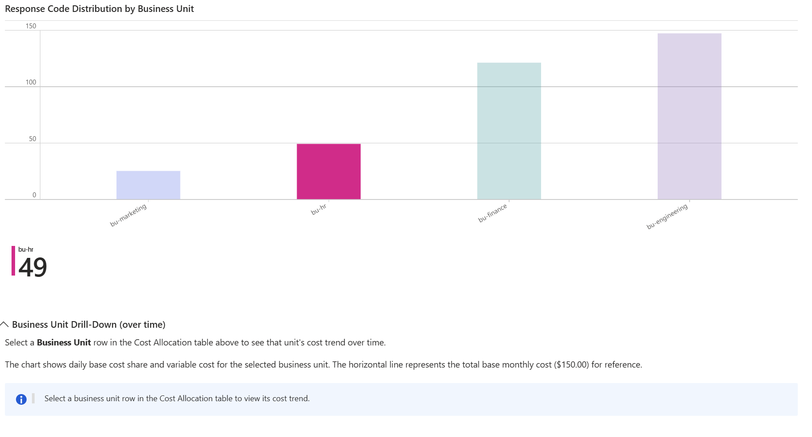

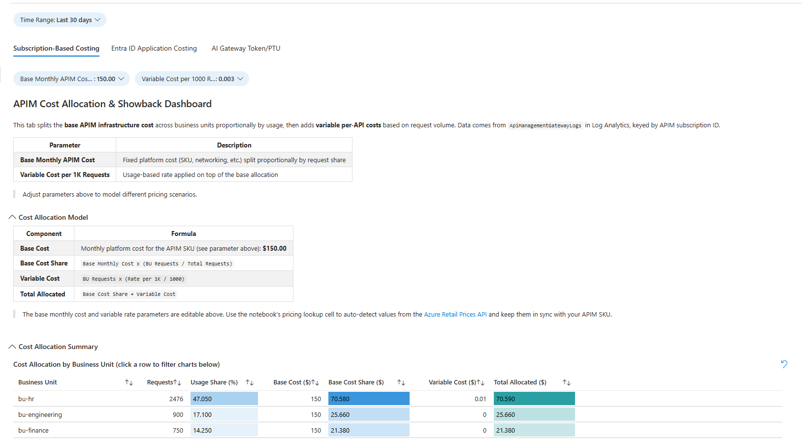

### Entra ID Application Costing Tab

The Entra ID tab shows cost attribution by calling application, using the `emit-metric` policy's `caller-requests` custom metric.

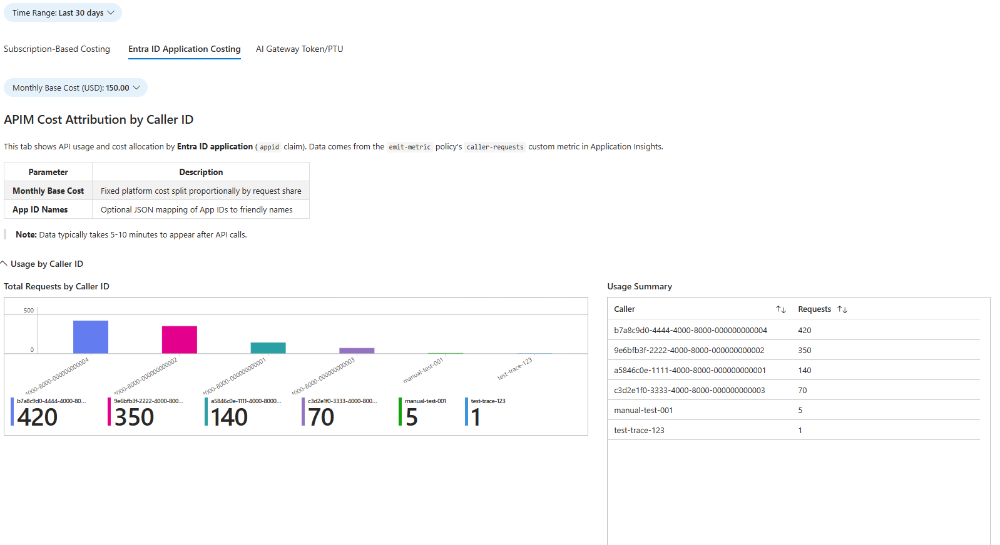

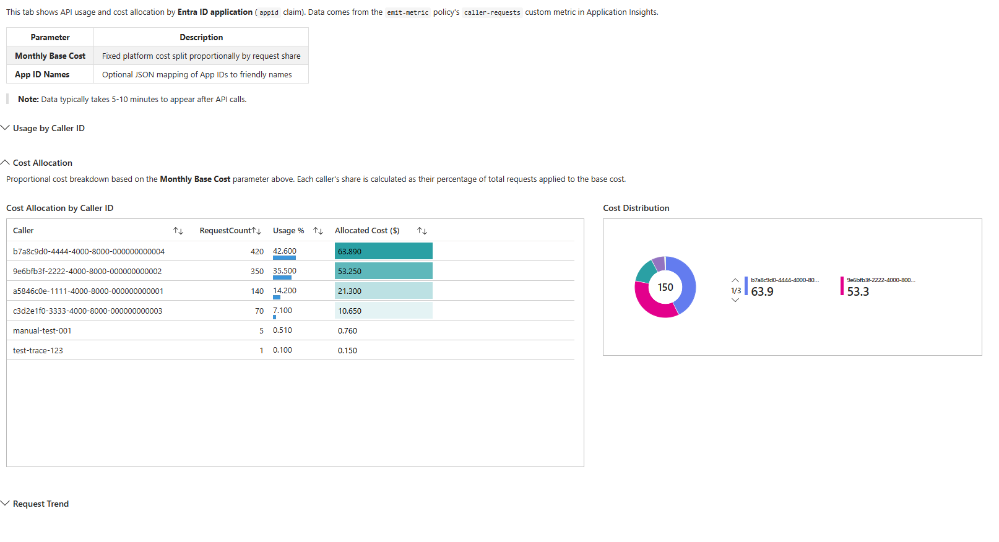

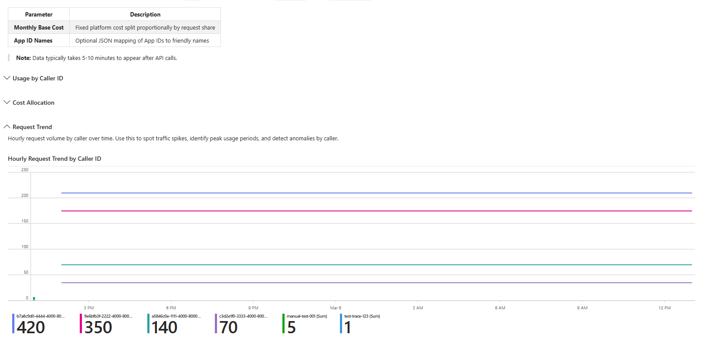

### AI Gateway Token/PTU Tab

The AI Gateway tab shows per-client token consumption and estimated costs when APIM is used as an AI Gateway in front of Azure OpenAI or other LLM backends. It uses the `emit-metric` policy's `caller-tokens` custom metric with `CallerId`, `TokenType` (prompt/completion/total), and `Model` dimensions.

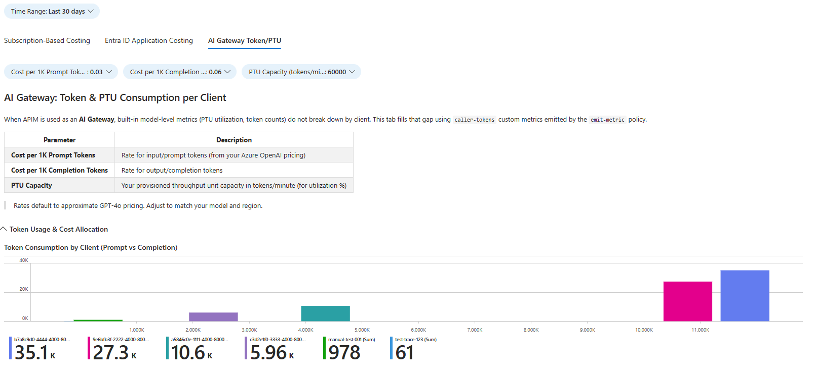

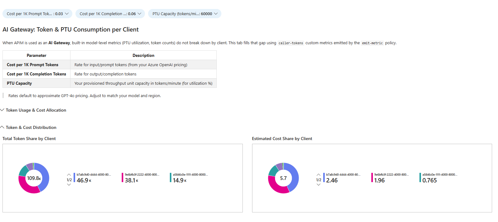

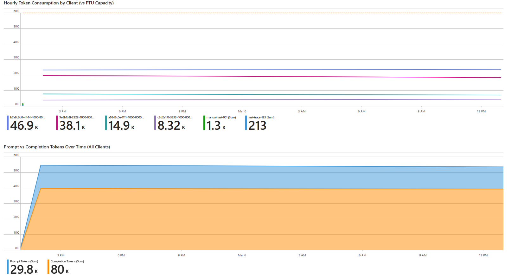

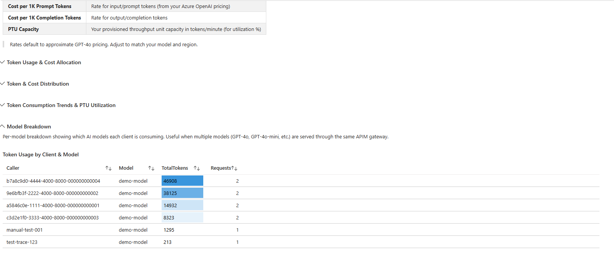

## 🧹 Clean Up

To remove all resources created by this sample, open and run `clean-up.ipynb`. This deletes:
- Sample API and subscriptions from APIM
- Application Insights, Log Analytics, Storage Account
- Azure Monitor Workbook
- Cost Management export

> The clean-up notebook does **not** delete your APIM instance or resource group.

## 🔗 Additional Resources

- [Azure API Management Pricing](https://azure.microsoft.com/pricing/details/api-management/)
- [Azure Retail Prices API](https://learn.microsoft.com/rest/api/cost-management/retail-prices/azure-retail-prices)
- [Azure Cost Management Documentation](https://learn.microsoft.com/azure/cost-management-billing/)
- [Log Analytics Kusto Query Language](https://learn.microsoft.com/azure/data-explorer/kusto/query/)
- [Azure Monitor Workbooks](https://learn.microsoft.com/azure/azure-monitor/visualize/workbooks-overview)
- [APIM Diagnostic Settings](https://learn.microsoft.com/azure/api-management/api-management-howto-use-azure-monitor)
- [APIM emit-metric policy](https://learn.microsoft.com/azure/api-management/emit-metric-policy)
- [Application Insights custom metrics](https://learn.microsoft.com/azure/azure-monitor/essentials/metrics-custom-overview)
- [Microsoft Entra ID application model](https://learn.microsoft.com/entra/identity-platform/application-model)
- [Azure OpenAI usage and token metrics](https://learn.microsoft.com/azure/ai-services/openai/how-to/monitoring)
- [PTU provisioned throughput concepts](https://learn.microsoft.com/azure/ai-services/openai/concepts/provisioned-throughput)

[infrastructure-architectures]: ../../README.md#infrastructure-architectures
[infrastructure-folder]: ../../infrastructure/
[simple-apim-infra]: ../../infrastructure/simple-apim/
